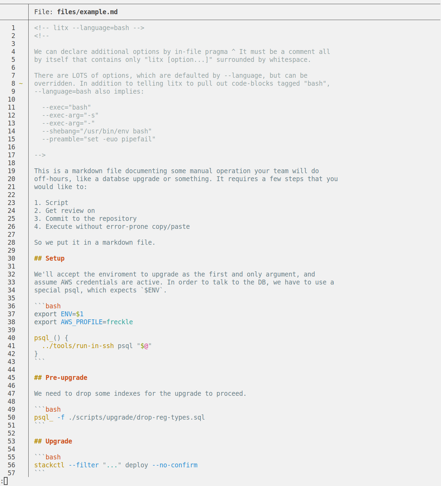

# LitX

Execute a Literate Markdown file.

## Motivation

At $JOB, we occasionally need to perform operations on our infrastructure that
cannot be completed (in whole or in part) by our usual [IaC][] tooling. For such
cases, we will still script the steps and commit that script to our
infrastructure repository by way of Pull Request -- this allows code review,
satisfies the two-person rule, and creates an audit trail.

[iac]: https://en.wikipedia.org/wiki/Infrastructure_as_code

[Literate Programming][literate] is a perfect fit for such scripts, which should
ideally be documented with context, warnings, and other details -- in a
maximally-readable format. A markdown file with the script embedded as
code-blocks throughout works well, but we still want to be able to execute those
code-blocks exactly as written without error-prone copy-pasting into a terminal.

[literate]: https://en.wikipedia.org/wiki/Literate_programming

LitX does exactly that.

## Example

Given [this input][input],



LitX can generate (and execute) [this output][output],


[input]: ./files/example.md
[output]: ./files/example.bash

## Basic Usage

Build and execute the code-blocks in `op.md`:

```console
litx <./op.md

litx --input ./op.md

litx --input - <./op.md
```

Build the code-blocks in `op.md` into `op.bash`, do not execute it:

```console
litx --no-execute <./.op.md >./op.bash

litx --input ./op.md --output ./op.bash

litx --input - --output - <./op.md >./op.bash
```

## Complete Usage

```console
% litx --help
TODO
```

---

[LICENSE](./LICENSE) | [CHANGELOG](./CHANGELOG.md)
